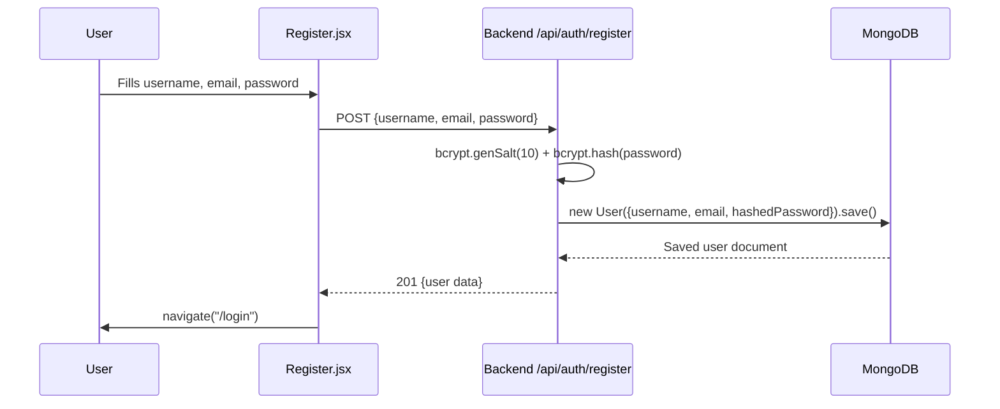
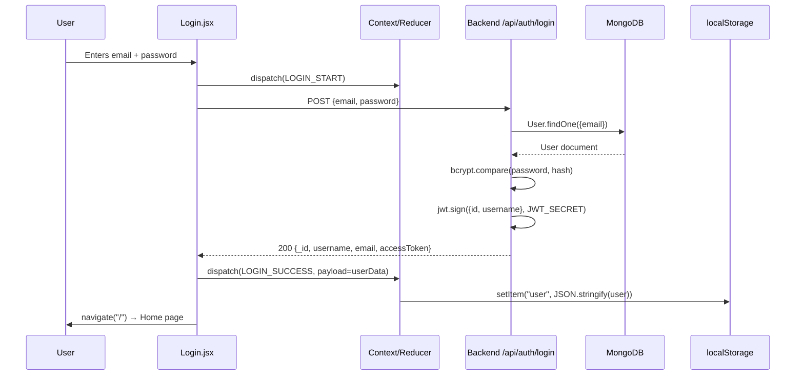
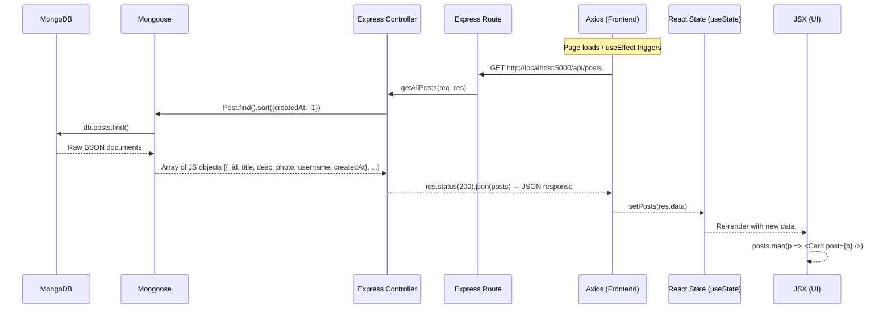

# Travel Journal — Fixes & Full Architecture Walkthrough

## What Was Fixed

| # | Bug | File(s) Changed |
|---|-----|-----------------|
| 1 | Frontend used `import.meta.env.VITE_API_URL` (Vite syntax) but project is **Create React App** — all API calls went to `undefined` | [Login.jsx](file:///d:/7th%20sem/Travel%20Journal/frontend/src/pages/Login.jsx), [Register.jsx](file:///d:/7th%20sem/Travel%20Journal/frontend/src/pages/Register.jsx), [Home.jsx](file:///d:/7th%20sem/Travel%20Journal/frontend/src/pages/Home.jsx), [Create.jsx](file:///d:/7th%20sem/Travel%20Journal/frontend/src/pages/Create.jsx), [View.jsx](file:///d:/7th%20sem/Travel%20Journal/frontend/src/pages/View.jsx), [MyPosts.jsx](file:///d:/7th%20sem/Travel%20Journal/frontend/src/pages/MyPosts.jsx), [Card.jsx](file:///d:/7th%20sem/Travel%20Journal/frontend/src/components/Card.jsx) |
| 2 | No `.env` file in frontend — backend URL was never defined | [.env](file:///d:/7th%20sem/Travel%20Journal/frontend/.env) **(NEW)** |
| 3 | `Entry.js`, `error.js`, `verifyToken.js` used ES module syntax (`import`/`export`) but backend uses CommonJS (`require`) | [Entry.js](file:///d:/7th%20sem/Travel%20Journal/backend/models/Entry.js), [error.js](file:///d:/7th%20sem/Travel%20Journal/backend/error.js), [verifyToken.js](file:///d:/7th%20sem/Travel%20Journal/backend/utils/verifyToken.js) |
| 4 | `verifyToken.js` used `process.env.JWT` but `.env` defines `JWT_SECRET` | [verifyToken.js](file:///d:/7th%20sem/Travel%20Journal/backend/utils/verifyToken.js) |
| 5 | Unused duplicate `authContext.js` cluttering the codebase | **DELETED** `src/authContext.js` |

---

## Verification Results

✅ **Backend**: `node index.js` → "Connected to MongoDB" + running on port 5000
✅ **Frontend**: `react-scripts start` → compiled with 1 lint warning (`FaEdit` unused import, harmless)
✅ **Register API**: `POST /api/auth/register` → 201, user created in MongoDB
✅ **Login API**: `POST /api/auth/login` → 200, returns user data + JWT `accessToken`

---

## How Your Project Works — File by File

### 🗂️ Project Structure

```
Travel Journal/
├── backend/            ← Express.js REST API (port 5000)
│   ├── index.js        ← Server entry point
│   ├── .env            ← MongoDB URI + JWT secret
│   ├── controllers/    ← Business logic (auth, posts)
│   ├── models/         ← MongoDB schemas (User, Post, Entry)
│   ├── routes/         ← Express routers (URL → controller)
│   └── utils/          ← Middleware (JWT verification)
│
└── frontend/           ← React app via CRA (port 3000)
    ├── .env            ← REACT_APP_API_URL=http://localhost:5000
    └── src/
        ├── index.js    ← React entry, wraps App in ContextProvider
        ├── App.jsx     ← Routes definition
        ├── context/    ← Auth state management (Context + Reducer)
        ├── components/ ← Reusable UI (Navbar, Card)
        ├── pages/      ← Page components (Home, Login, Register, Create, View, MyPosts)
        └── styles/     ← CSS files per component
```

---

### 🔐 Registration Flow (step by step)



**Files involved:**
1. **[Register.jsx](file:///d:/7th%20sem/Travel%20Journal/frontend/src/pages/Register.jsx)** — Form collects username, email, password. On submit → `axios.post` to `/api/auth/register`. On success → redirects to `/login`.
2. **[routes/auth.js](file:///d:/7th%20sem/Travel%20Journal/backend/routes/auth.js)** — Maps `POST /register` → `authController.register`.
3. **[authController.js](file:///d:/7th%20sem/Travel%20Journal/backend/controllers/authController.js)** — Hashes password with bcrypt, creates a `User` document, saves to MongoDB.
4. **[User.js](file:///d:/7th%20sem/Travel%20Journal/backend/models/User.js)** — Mongoose schema: `username` (unique), `email` (unique), `password` + timestamps.

---

### 🔑 Login Flow



**Files involved:**
1. **[Login.jsx](file:///d:/7th%20sem/Travel%20Journal/frontend/src/pages/Login.jsx)** — Form with email + password. Dispatches `LOGIN_START`, calls `/api/auth/login`, dispatches `LOGIN_SUCCESS` with the response data.
2. **[Context.jsx](file:///d:/7th%20sem/Travel%20Journal/frontend/src/context/Context.jsx)** — React Context + `useReducer`. Stores `{user, isFetching, error}`. Persists `user` to `localStorage` on every change.
3. **[Reducer.jsx](file:///d:/7th%20sem/Travel%20Journal/frontend/src/context/Reducer.jsx)** — Handles `LOGIN_START` (sets loading), `LOGIN_SUCCESS` (stores user), `LOGIN_FAILURE` (clears user), `LOGOUT` (clears user).
4. **[authController.js](file:///d:/7th%20sem/Travel%20Journal/backend/controllers/authController.js)** — Finds user by email, compares password with bcrypt, creates JWT with `{id, username}`, returns user data (excluding password) + `accessToken`.

---

### 📝 Creating a Post

```mermaid
sequenceDiagram
    participant User
    participant Create.jsx
    participant Backend /api/upload
    participant Backend /api/posts
    participant MongoDB

    User->>Create.jsx: Types title, description, picks image
    Create.jsx->>Backend /api/upload: POST FormData (image file)
    Backend /api/upload-->>Create.jsx: 200 "File uploaded"
    Create.jsx->>Backend /api/posts: POST {title, desc, photo, username}
    Backend /api/posts->>MongoDB: new Post({...}).save()
    MongoDB-->>Backend /api/posts: Saved post
    Backend /api/posts-->>Create.jsx: 201 {post data with _id}
    Create.jsx->>User: navigate("/post/{id}")
```

**Files involved:**
1. **[Create.jsx](file:///d:/7th%20sem/Travel%20Journal/frontend/src/pages/Create.jsx)** — Gets `user.username` from Context. If image selected, uploads it first via `/api/upload` (multer), then creates the post via `/api/posts`.
2. **[index.js (backend)](file:///d:/7th%20sem/Travel%20Journal/backend/index.js)** — Configures `multer` disk storage to save files to `/images` folder. Serves images as static files via `express.static`.
3. **[routes/posts.js](file:///d:/7th%20sem/Travel%20Journal/backend/routes/posts.js)** — Maps CRUD routes: `POST /` (create), `PUT /:id` (update), `DELETE /:id` (delete), `GET /:id` (single), `GET /` (all).
4. **[postController.js](file:///d:/7th%20sem/Travel%20Journal/backend/controllers/postController.js)** — Creates, updates, deletes, and fetches posts. Update/delete check `username` ownership.
5. **[Post.js](file:///d:/7th%20sem/Travel%20Journal/backend/models/Post.js)** — Schema: `title` (unique), `desc`, `photo`, `username` + timestamps.

---

### 🏠 Viewing Posts (Home + Single Post)

- **[Home.jsx](file:///d:/7th%20sem/Travel%20Journal/frontend/src/pages/Home.jsx)** — On mount, fetches `GET /api/posts` → renders all posts as `Card` components.
- **[Card.jsx](file:///d:/7th%20sem/Travel%20Journal/frontend/src/components/Card.jsx)** — Displays post image, title, date, description snippet. Links to `/post/{id}`.
- **[View.jsx](file:///d:/7th%20sem/Travel%20Journal/frontend/src/pages/View.jsx)** — Fetches `GET /api/posts/{id}`. Shows full post detail. If current user owns the post, shows a delete icon.
- **[MyPosts.jsx](file:///d:/7th%20sem/Travel%20Journal/frontend/src/pages/MyPosts.jsx)** — Fetches `GET /api/posts?user={username}` → shows only the logged-in user's posts.

---

### 🧭 Navigation & Auth Guards

**[App.jsx](file:///d:/7th%20sem/Travel%20Journal/frontend/src/App.jsx)** defines all routes:

| Route | Component | Auth |
|-------|-----------|------|
| `/` | Home | Public |
| `/register` | Register (or Home if logged in) | Redirects logged-in users |
| `/login` | Login (or Home if logged in) | Redirects logged-in users |
| `/create` | Create (or Login if not logged in) | **Protected** |
| `/myposts` | MyPosts (or Login if not logged in) | **Protected** |
| `/post/:id` | View | Public |

**[Navbar.jsx](file:///d:/7th%20sem/Travel%20Journal/frontend/src/components/Navbar.jsx)** — Shows HOME always. Shows MY POSTS + CREATE + LOGOUT when logged in. Shows LOGIN + REGISTER when logged out. Displays "Welcome, {username}!" for logged-in users.

---

### 🔄 How Frontend Talks to Backend

The frontend `.env` defines `REACT_APP_API_URL=http://localhost:5000`. Every API call uses `process.env.REACT_APP_API_URL` as the base URL. Axios sends JSON requests. CORS is enabled on the backend via `cors()` middleware, allowing the React dev server (port 3000) to talk to Express (port 5000).

### 🗄️ How Backend Connects to MongoDB

[index.js](file:///d:/7th%20sem/Travel%20Journal/backend/index.js) loads `dotenv.config()`, then calls `mongoose.connect(process.env.MONGO_URI)` using the connection string from `.env`. All data (users, posts) is stored in MongoDB Atlas.

---

### 📡 How Backend Data is Shown in the Frontend

This is the **reverse direction** — how data travels from MongoDB all the way to what the user sees on screen.



#### Step-by-step breakdown:

**Step 1 — React component mounts → triggers API call**
In [Home.jsx](file:///d:/7th%20sem/Travel%20Journal/frontend/src/pages/Home.jsx), `useEffect` runs on first render:
```jsx
useEffect(() => {
    const fetchAllPosts = async () => {
        const res = await axios.get(`${process.env.REACT_APP_API_URL}/api/posts`);
        setPosts(res.data);  // ← stores backend response in React state
    };
    fetchAllPosts();
}, []);
```

**Step 2 — Axios sends HTTP GET to backend**
The request goes to `http://localhost:5000/api/posts`. CORS middleware on the backend allows this cross-origin request.

**Step 3 — Express router matches the URL**
In [routes/posts.js](file:///d:/7th%20sem/Travel%20Journal/backend/routes/posts.js):
```js
router.get("/", postController.getAllPosts);  // matches GET /api/posts
```

**Step 4 — Controller queries MongoDB via Mongoose**
In [postController.js](file:///d:/7th%20sem/Travel%20Journal/backend/controllers/postController.js):
```js
posts = await Post.find().sort({ createdAt: -1 });  // newest first
res.status(200).json(posts);  // sends JSON array back to frontend
```
Mongoose converts MongoDB BSON documents into plain JavaScript objects.

**Step 5 — Axios receives JSON → stores in React state**
`res.data` is the parsed JSON array. `setPosts(res.data)` triggers a **re-render** of the component.

**Step 6 — JSX maps data into UI components**
```jsx
{posts.map(p => <Card key={p._id} post={p} />)}
```
Each post object is passed as a `prop` to [Card.jsx](file:///d:/7th%20sem/Travel%20Journal/frontend/src/components/Card.jsx), which renders:
- `post.photo` → `` tag (image URL points to `http://localhost:5000/images/{filename}`)
- `post.title` → `<h3>`
- `post.createdAt` → formatted date string
- `post.desc` → `<p>` paragraph

**Step 7 — Images served from backend**
When a Card renders ``, the browser makes a **separate HTTP request** to the backend. Express serves it via:
```js
app.use("/images", express.static(path.join(__dirname, "/images")));
```
This serves files directly from the `backend/images/` folder — no controller needed.

#### The same pattern repeats everywhere:

| Page | API Call | What Gets Rendered |
|------|----------|--------------------|
| [Home.jsx](file:///d:/7th%20sem/Travel%20Journal/frontend/src/pages/Home.jsx) | `GET /api/posts` | All posts as Card grid |
| [MyPosts.jsx](file:///d:/7th%20sem/Travel%20Journal/frontend/src/pages/MyPosts.jsx) | `GET /api/posts?user={username}` | Only logged-in user's posts |
| [View.jsx](file:///d:/7th%20sem/Travel%20Journal/frontend/src/pages/View.jsx) | `GET /api/posts/{id}` | Single post full detail |

> **Key insight for interviews:** The frontend **never** talks to MongoDB directly. It always goes through the backend API. React manages the UI state, Axios handles HTTP, Express handles routing/logic, Mongoose handles database queries. Each layer has a single responsibility.

---

## To Run the Project

```bash
# Terminal 1 — Backend
cd "d:\7th sem\Travel Journal\backend"
npm start

# Terminal 2 — Frontend
cd "d:\7th sem\Travel Journal\frontend"
npm start
```

Then open **http://localhost:3000** in your browser.
